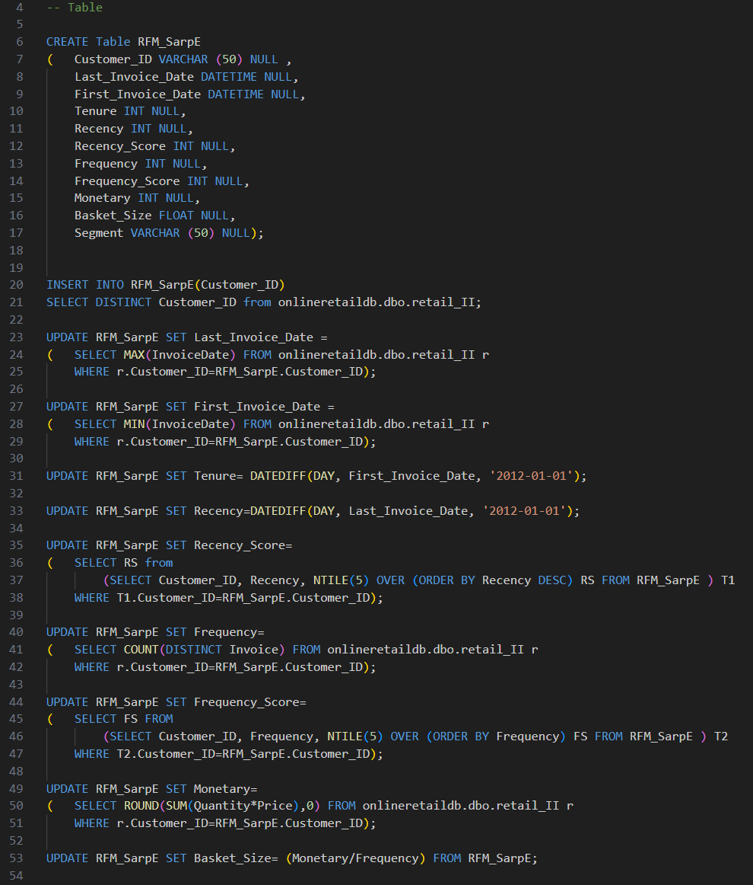
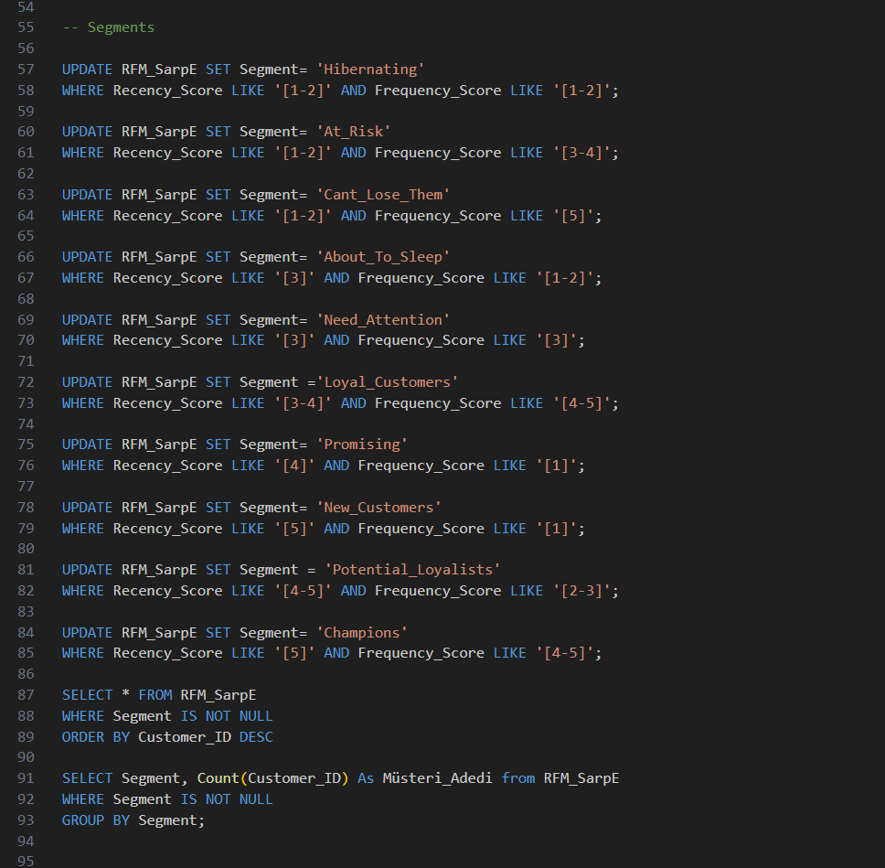
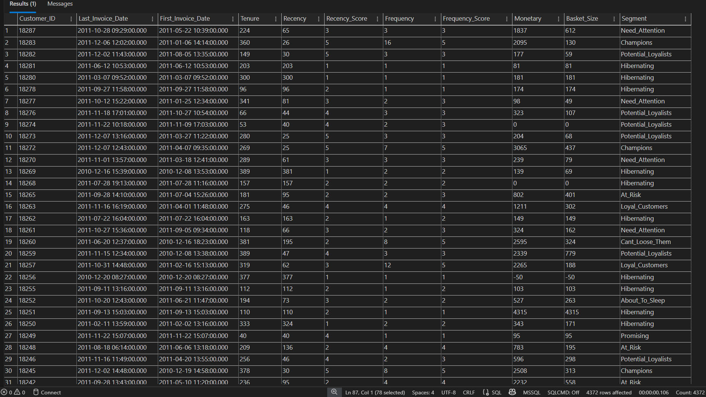
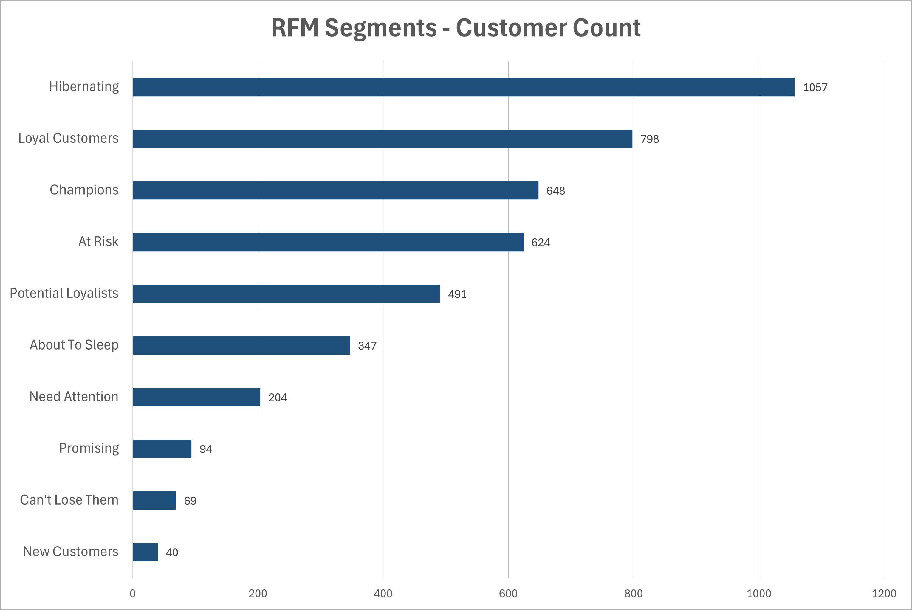

# PulseRFM
**Customer Segmentation using RFM Analysis in SQL**

---

## Overview
RFM (Recency, Frequency, Monetary) analysis built in SQL Server to segment customers based on purchasing behaviour. Customers are scored using NTILE(5) and assigned to one of 10 segments.

## Segments
| Segment | Description |
|---|---|
| Champions | Recent, frequent, high spenders |
| Loyal Customers | Regular buyers, recently active |
| Potential Loyalists | Recent buyers with growing frequency |
| New Customers | Bought recently but only once |
| Promising | Recent, low frequency |
| Need Attention | Average across all metrics |
| About to Sleep | Below average recency |
| At Risk | Used to buy often, not recently |
| Can't Lose Them | High frequency, long gone |
| Hibernating | Low recency and frequency |

## Code

## Output

## Results

## Files
| File | Description |
|---|---|
| `sql1.sql` | Northwind & Online Retail queries — delivery analysis, monetary, recency, country-level revenue |
| `sql2.sql` | Full RFM table build — scoring, segmentation |
| `sql1.xlsx` | Output: Part 1 query results |
| `sql2.xlsx` | Output: RFM segment results |

## Tools
- SQL Server (T-SQL)
- Northwind DB
- Online Retail DB
